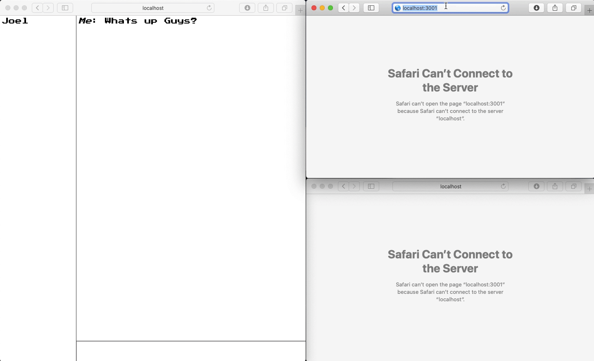

# A Silly Little Chat-App

I've always wanted to know how real-time chat windows work so I decided to dive into [flavio's](https://medium.com/free-code-camp/how-to-build-a-chat-application-using-react-redux-redux-saga-and-web-sockets-47423e4bc21a) tutorial and try it out for myself.



## What did I learn?

This tutorial was a good place to start but it didn't do the best job explaining things... This led me reading hours of documentation on WebSockets and in the end I learned more on my own than the tutorial could offer.

- WebSockets are some pretty cool shit but can be extremely tricky to manage

- React Middleware is also pretty cool shit

- Creating the client and server-side code was somewhat confusing because they both share so much of the same vernacular

- I hadn't been using Redux properly before this project. I was forced to finally do things the right way in this project

- I really need more than 1 monitor 🥵

- I had no idea that React included typechecking. Coming from a strongly typed language background I like the structure and bug-prevention PropType offers.

I still get confused about ES6 Generators. I'll be honest and admit that I just copied and pasted the following and was happy when everything worked magically.

```js
const handleNewMessage = function* handleNewMessage(params) {
  yield takeEvery(types.ADD_MESSAGE, (action) => {
    action.author = params.username;
    params.socket.send(JSON.stringify(action));
  });
};
```

Giving store access to all components via the Provider makes things so much more simpler

```js
ReactDOM.render(
  <Provider store={configureStore()}>
    <App />
  </Provider>,
  document.getElementById("root")
);
```

Pulling out Redux state and props into a container removes the tight-coupling of React component with Redux state

```js

// AddMessage Container
const mapDispatchToProps = (dispatch) => ({
  addMessage: (message, author) => {
    dispatch(addMessage(message, author));
  },
  addUser: (name) => {
    dispatch(addUser(name));
  },
});

export const AddMessage = connect(
  () => ({}),
  mapDispatchToProps
)(AddMessageComponent);

// AddMessage Component
class AddMessage extends React.Component {
  render() {
    return (
    );
  }
}

export default AddMessage;

```

## But #balbyu, how do I run this on my computer?

Dear Reader, thank you for asking. It is a very simple process.

Clone the repo and install dependencies

### `npm install`

and start the server from the server folder

### `node app.js`

and start the React client from root folder in a new terminal

### `npm start`

The client will be assigned a random username every time they connect to the server. Their username is added to the server's current list of users when they connect, and it is removed when they disconnect. Message history is unfortunately not preserved, but I will be implementing this feature in the near future.

## Future Improvements (that may or may not get done)

- Preserved chat history for all users
- Modern UI
- Timestamps for messages
- Unit Testing
- Hosted on a website
